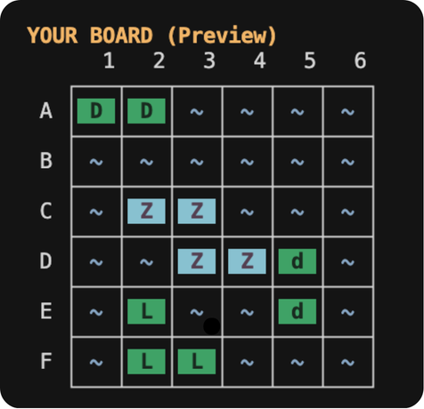

# Battleship - Multiplayer Network Game



A production-quality, multiplayer turn-based Battleship game implemented in pure C using POSIX sockets and threading. Features a beautiful ANSI-colored terminal UI and custom ship shapes inspired by Sea Battle 2.

## Features

- **6×6 Grid** (rows A-F, columns 1-6)
- **4 Simple Ships**:
  - One 2-cell Destroyer (horizontal: DD)
  - One 2-cell Destroyer (vertical)
  - One 3-cell L-shaped ship
  - One 4-cell Z-shaped ship
- **Real TCP Networking** - works across different machines on the same network
- **Client-Server Architecture** - with authoritative server
- **Multi-threaded** - one thread per client
- **Terminal UI** with ANSI colors
- **Simple ship placement**
- **Fog of war** - can't see opponent's ships until you hit them
- **Graceful disconnect handling**

## Technical Highlights
- POSIX sockets with non-blocking I/O
- Thread-safe game state with mutexes
- Binary network protocol with proper serialization
- Comprehensive input validation and error handling
- Clean modular architecture with separated concerns
- CMake build system

## Prerequisites

- Linux or macOS
- CMake 
- pthread library (included in POSIX systems)

## Building the Project

```bash
# Clone or navigate to the project directory
cd Computer-Programming-Project

# Build the program using CMake

cmake -B build
cmake --build build

# Executables will be in the build directory:
./build/server
./build/client
```

## Running the Game

### Option 1: Single Machine Testing (Local)

**Terminal 1 - Start Server:**
```bash
cd build
./server 8080
```

```
To find your IP for other players, use:
  macOS/Linux: ifconfig | grep "inet "
  Windows: ipconfig
```

**Terminal 2 - Player 1:**
```bash
./build/client 127.0.0.1 8080 Kiril
```

**Terminal 3 - Player 2:**
```bash
./build/client 127.0.0.1 8080 Rodrigo
```

### Option 2: Multiple Machines (Network Play)
 All machines must be on the same network (Wi-Fi, LAN, or campus network).

**Machine 1 - Server:**
```bash
./build/server 8080    # Use 8080 for macOS (5000 conflicts with AirPlay)
```

**Find your server's IP address using:**

**On macOS:**
```bash
ifconfig | grep "inet " | grep -v 127.0.0.1
```


**On Windows:**
```bash
ipconfig
```

**Then share the IP with other players (e.g., `192.168.1.50`)**

**Machine 2 - Player 1:**
```bash
./build/client 192.168.1.50 8080 Player1    
# Use your server's IP
```

**Machine 3 - Player 2:**
```bash
./build/client 192.168.1.50 8080 Player2    
# Use your server's IP
```

## How to Play

### Phase 1: Ship Placement

Each player must place all 4 ships on their board:

1. **Destroyer (Horizontal)**: 2 cells - DD
2. **Destroyer (Vertical)**: 2 cells
3. **L-Ship**: 3 cells in L-shape
4. **Z-Ship**: 4 cells in Z-shape

**Placement Format:**
```
<ROW><COLUMN>
```

**Example:**
```
A1    - Places Ship at A1
```

**Ship Shapes (Fixed Orientations):**
- **Destroyer (Horizontal)**: `DD` (2 cells wide)
- **Destroyer (Vertical)**: `D` over `D` (2 cells tall)
- **L-Ship**: `X` then `XX` (corner shape)
- **Z-Ship**: `ZZ` then ` ZZ` (zigzag)

The game validates your placement and prevents:
- Ships going out of bounds
- Ships overlapping
- Placing the same ship twice

### Phase 2: Battle

Players take turns shooting at the opponent's board.

**Shooting Format:**
```
<ROW><COLUMN>
```

**Examples:**
```
A1    - Shoot at row A, column 1
D5    - Shoot at row D, column 5
F6    - Shoot at row F, column 6
```

**Results:**
- **MISS** (·) - Shot hit water
- **HIT** (X) - Shot hit a ship
- **SUNK** (X) - Shot destroyed the last cell of a ship

**Win Condition:** First player to sink all 4 opponent ships wins!

## Game Board Legend

```
~ (blue)   - Water / Unknown
· (gray)   - Miss
X (red)    - Hit
D,d,L,Z    - Your ships (only visible on your board)
           - D = Horizontal Destroyer
           - d = Vertical Destroyer
```

## Project Structure

```
Computer-Programming-Project/
├── CMakeLists.txt           # Build configuration
├── README.md                # This file
├── common/                  # Shared code
│   ├── protocol.h           # Network protocol definitions
│   ├── serialize.c/h        # Message serialization
│   ├── game_logic.c/h       # Game rules and validation
│   ├── ship_shapes.c/h      # Ship definitions
│   └── utils.c/h            # Network and utility functions
├── server/                  # Server implementation
│   ├── main.c               # Server entry point
│   ├── server.c             # Server logic
│   └── server.h             # Server interface
└── client/                  # Client implementation
    ├── main.c               # Client entry point
    ├── client.c             # Client logic
    ├── client.h             # Client interface
    ├── ui.c                 # Terminal UI rendering
    └── ui.h                 # UI interface
```

## Technical Architecture

### Threading Model

- **Main thread**: Accepts connections, manages game state
- **Client threads**: One per player, handles messages from that client
- **Mutex protection**: All shared game state access is synchronized

### Ship Shape System

Ships are defined as arrays of cell offsets from a base position. Each ship has a fixed orientation (no rotation). The validation system checks bounds and overlaps before placement.

### Game State Machine

**Server States:**
- WAITING → PLACEMENT → PLAYING → FINISHED

**Client States:**
- CONNECTING → WAITING → PLACEMENT → PLAYING → FINISHED

## Performance Notes

- Server handles 2 concurrent players efficiently
- Message overhead: 3-byte header + payload
- Typical round-trip latency: <10ms on LAN
- Memory footprint: <5MB per process
- Thread overhead: ~8KB per client thread


## License

This is a university project. Free to use for educational purposes.

## Credits

Ship shapes inspired by Sea Battle 2 / Warships Fleet.

Built using C, POSIX sockets, and pthreads.

---

**Enjoy the game!**


